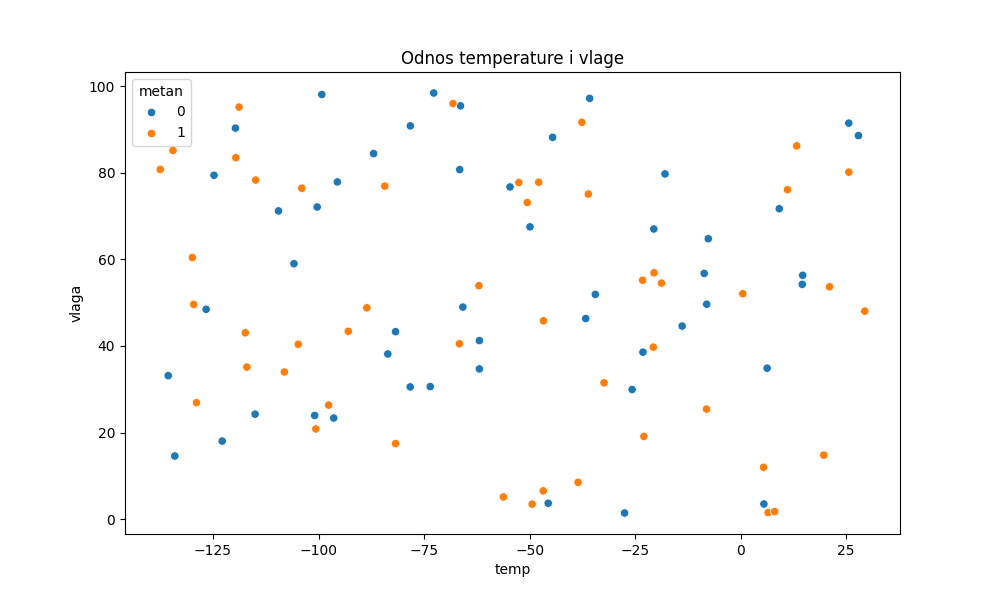
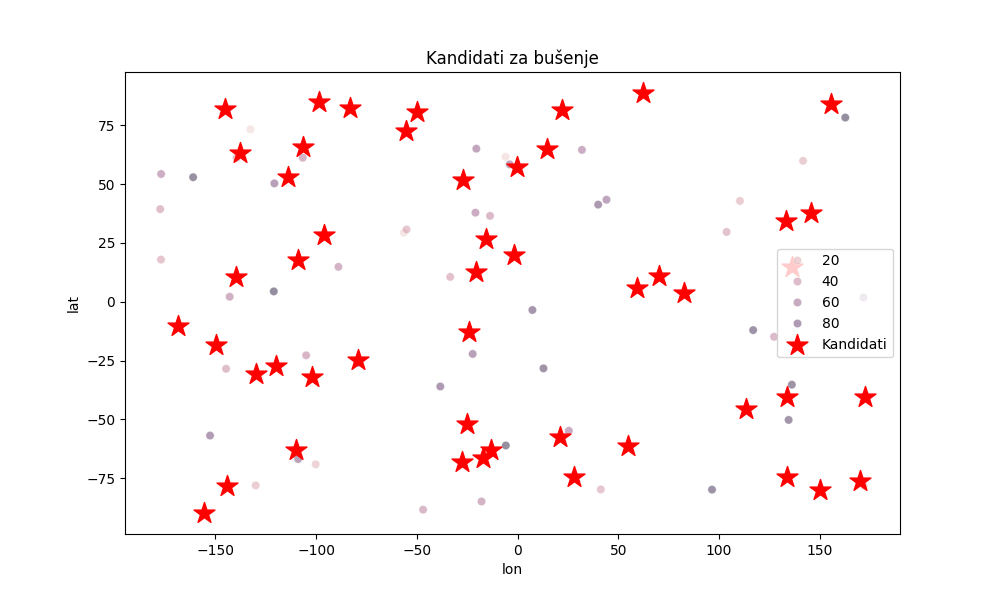
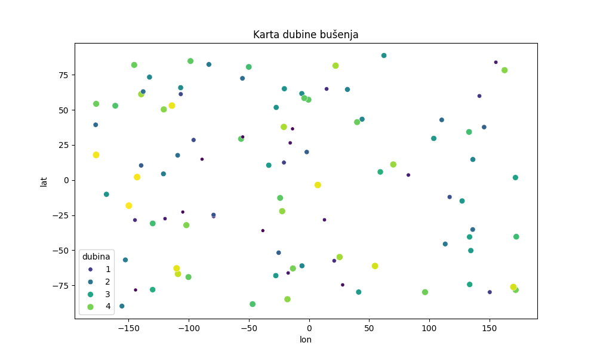
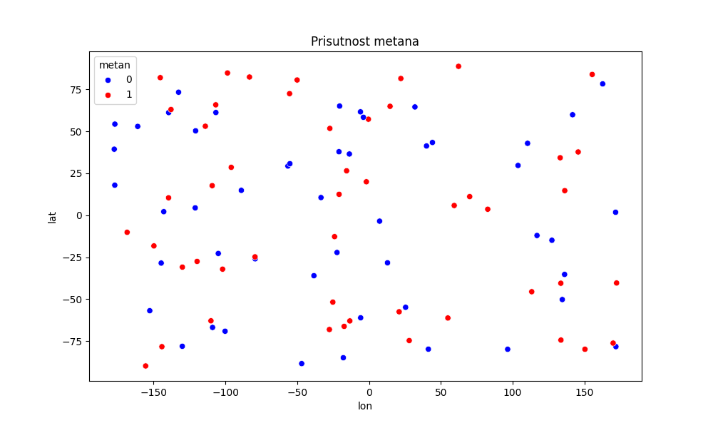

## A. Izvršni sažetak (Executive Summary)
Ovaj analitički izvještaj dokumentira razvoj sustava za procesiranje telemetrijskih podataka prikupljenih unutar kratera Jezero na Marsu. Svrha misije je transformacija sirovih senzorskih podataka (dubina, temperatura, pH, koncentracija metana) u automatizirani navigacijski nalog u JSON formatu. Sustav koristi napredne algoritme za filtriranje podataka kako bi omogućio terenskom robotu autonomno prepoznavanje prioritetnih znanstvenih zona, osiguravajući pritom navigaciju kroz sigurne topografske koridore.

## B. Metodologija obrade podataka (Data Wrangling)
Analitički model temelji se na rigoroznoj obradi sirovih podataka unutar `pandas` okruženja. Ključne algoritamske odluke uključuju:
*   **Filtriranje senzorskog šuma:** Primijenjeni su logički uvjeti na DataFrame objekte kako bi se uklonili "outlieri" nastali uslijed ekstremnih marsovskih uvjeta. Primjerice, očitanja temperature izvan raspona automatski su odbačena kao sistemski šum.
*   **Validacija anomalija:** Metodologija prepoznavanja anomalija u pH vrijednostima (npr. nagle fluktuacije koje ne odgovaraju geološkom sastavu) ključna je za dokazivanje ispravnosti modela, čime se sprječava slanje robota u zone s pogrešnim očitanjima.

## C. Geoprostorna analiza i vizualizacija
U nastavku je predstavljeno pet ključnih dokaznih materijala analize.

### 1. Matrica korelacije parametara

*Interpretacija:* Ovaj grafikon identificira međuovisnost faktora. Visoka korelacija ukazuje na stabilna geološka područja pogodna za stacionarna mjerenja.

### 2. Distribucija atmosferske temperature

*Interpretacija:* Histogram prikazuje termalnu stabilnost sektora. Zone s ekstremnim oscilacijama automatski se klasificiraju kao rizične za hardver robota.

### 3. Toplinska karta dubine (Bathymetry Heatmap)

*Interpretacija:* Vizualizacija gradijenta dubine služi za izbjegavanje opasnih nagiba. Tamnije zone predstavljaju depresije koje rover mora obići radi održavanja stabilnosti.

### 4. Prostorna rasprostranjenost metana

*Interpretacija:* Scatter plot s intenzitetom boja prikazuje koncentraciju metana. Područja u crvenom spektru su prioritetne točke interesa (POI) za biološku prospekciju.

### 5. Završna satelitska mapa (Extent Mapping)

*Interpretacija:* Završna vizualizacija koristi tehnički koncept **extent mapiranja** (postavljanje preciznih prostornih granica `[xmin, xmax, ymin, ymax]`). Kontekstualno pozicioniranje raspršenih podataka na stvarne GPS koordinate omogućuje robotu preciznu orijentaciju u 360° unutar kratera.

## D. Komunikacijski protokol (JSON Uplink)
Nakon analize, sustav generira navigacijski paket.

```json
{
  "uplink_id": "JEZERO_NAV_2026",
  "navigation_commands": [
    {
      "step": 1,
      "coords": {"lat": 18.452, "lon": 77.456},
      "action": "move_to_poi"
    },
    {
      "step": 2,
      "coords": {"lat": 18.455, "lon": 77.460},
      "action": "soil_sampling"
    }
  ]
}
```

## E. Inženjerski dnevnik (Troubleshooting Log)
Tijekom razvoja riješene su sljedeće kritične prepreke:

1.  **Simptom:** Pogrešno učitavanje relacijskih tablica.
    *   **Uzrok:** Korištenje pogrešnog separatora (točka-zarez) u izvornoj CSV datoteci.
    *   **Rješenje:** Implementiran parametar `sep=';'` unutar `read_csv` funkcije nakon manualne inspekcije sirovih podataka.
2.  **Simptom:** Geoprostorni podaci se nisu preklapali sa satelitskom mapom.
    *   **Uzrok:** Pogrešno definirane granice u *extent* parametru.
    *   **Rješenje:** Ponovni izračun rubnih GPS koordinata kako bi se osiguralo 
